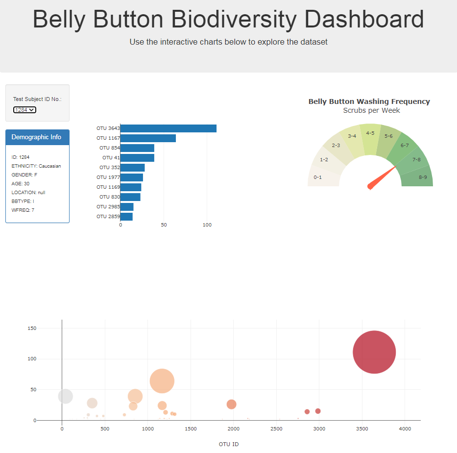

# Belly-Button Biodiversity data

## Background

This is an interactive application to explore the Belly Button Biodiversity Dataset using Plotly.js and GitHub

 

## Objectives

### Step 1 - Plotly.js

Use Plotly.js to build interactive plots for the page:

* Metadata per test subject ID number (interactive selection).

* Bar Chart that displays the top 10 samples per test subject ID number selected

* Gauge Chart that displays the Weekly Washing Frequency per test subject selected

* Create a Bubble Chart to display the sample values per Operational Taxonomic Unit (OTU) corresponding to the test subject selected

### Step 2 - Publishing the application

The application was deplolyed in GitHub Pages, as it can serve as a free static page hosting service.

